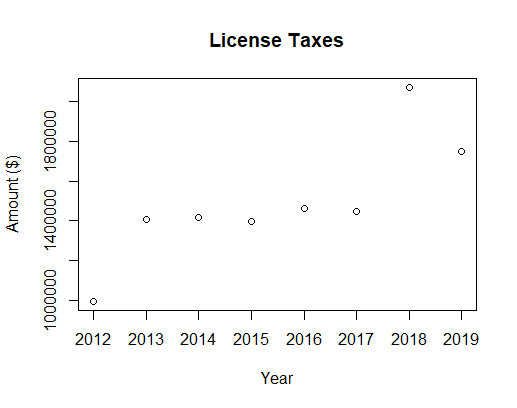

# DATA115
Home for data project
## Topic: Washington state government finance

This project aims to understand WA state's financial health.

## Questions:
### (1) Which resource accounts for the most revenue of the state government?
### (2) Which resource of the revenue has the highest growth rate in the last 5 years?
### (3) What is the trend of the fiscal year financial balance of WA in the past 10 years? Surplus or debt? Growing or decline?

## Figure 1

*Caption: Total Taxes are the sum of the General Sales and Gross Receipts Taxes, Selective Sales and Gross Receipts Taxes, License Taxes, and All Other Taxes.*

## Figure 2

*The outliers happend in 2012 and 2018. The WA state government had extremely low License Tax collection in 2012, and extremely high amount in 2018.*

*Total Revenue = General Revenue + Liquor Store Revenue + Untility Revenue + Insurance Trust Revenue*

*General Revenue = Intergovernmental Revenue + Total Taxes + Current Charges + Miscellaneous General Revenue*

*Total Taxes = General Sales and Gross Receipts Taxes + Selective Sales and Gross Receipts Taxes + License Taxes +All Other Taxes*
