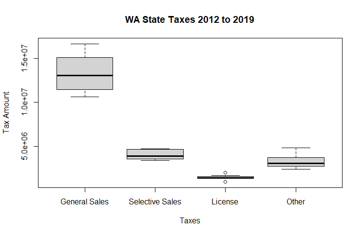

# DATA115
Home for data project
## Topic: Washington state government finance

This project aims to understand WA state's financial health.

## Questions:
### (1) Which resource accounts for the most revenue of the state government?
### (2) Which resource of the revenue has the highest growth rate in the last 5 years?
### (3) What is the trend of the fiscal year financial balance of WA in the past 10 years? Surplus or debt? Growing or decline?

"Caption:" WA state's Taxes 
![https://github.com/yjysquid/DATA115/blob/main/WA_tax.png]
Total Revenue = General Revenue + Liquor Store Revenue + Insurance Trust Revenue
Total Taxes = General Sales and Gross Receipts Taxes + Selective Sales and Gross Receipts Taxes + License Taxes +All Other Taxes
